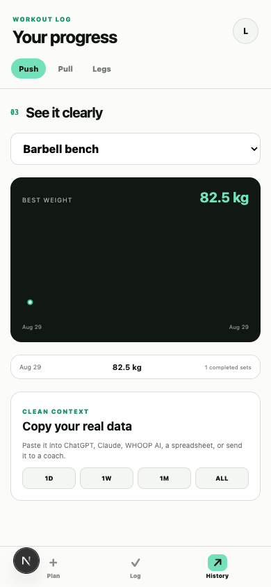

# Workout Logger

> **v1 — rough on purpose.** This is what I actually use, not a
> finished product. Some of it is ugly and some of it will break.
> If it breaks for you, say so in the Discord and I'll fix it.

A workout app that's actually yours. Log your sets, see your graphs,
and copy your whole history into Claude or ChatGPT whenever you want
to ask it something about your training.

<p align="center">
  
</p>

That last card is the whole point — one tap and your real training
history is in your clipboard, ready to paste into Claude, ChatGPT,
a spreadsheet, or a coach.

**Just want the simple version?** Ep. 1 builds a single-file logger
in one prompt — no accounts, no setup, on your phone in 10 minutes:
**[github.com/ohwisey/ep1](https://github.com/ohwisey/ep1)**

This repo is the bigger one. Here's how to run it even if you've
never touched code.

---

## Get it running (10 minutes, no experience needed)

**1. Get Claude Code**

Open your terminal and paste:

```
npm install -g @anthropic-ai/claude-code
```

(If you don't have `npm`, install Node.js first from nodejs.org —
just click the big download button.)

**2. Download this repo and open Claude Code in it**

```
git clone https://github.com/ohwisey/workout-logger-public.git
cd workout-logger-public
claude
```

**3. Paste this to Claude and let it work**

```
Get this app running on my computer. It's a Next.js project.
Skip the Supabase setup for now — I know it runs in local-only
mode without it. Install whatever it needs, start the dev server,
and tell me the URL to open. If anything breaks, fix it and keep
going. Explain what you're doing in plain English as you go.
```

That's it. Claude installs everything, starts it, and hands you a
link. Open it and start logging sets.

Your data lives in your browser. Nothing is uploaded anywhere.

---

## When you want more

**Put it on your phone.** Ask Claude:

```
Deploy this to Vercel so I can open it on my phone and add it to
my home screen. Walk me through anything you need me to click.
```

**Make it sync across devices.** This needs a free Supabase account.
Ask Claude:

```
Set up Supabase for this app so my data syncs between my laptop and
my phone. Create the account steps for me, apply the SQL migrations
in supabase/migrations, and put the keys in .env.local. Tell me
exactly what to click and never show my keys on screen.
```

**Change anything.** It's yours now:

```
Add a body-weight field to the log screen and show it on the graph.
```

---

## Feedback and questions

Show me what you built, or ask when you get stuck:
**[discord.gg/A8bzYw6cCF](https://discord.gg/A8bzYw6cCF)**

---

## What's in it

- Build a workout day from a 57-exercise library
- Log the weight and reps you actually completed
- One graph per exercise, and a clean export for any AI
- Custom exercises with a camera photo, so an odd gym machine keeps
  its own history

Not included: AI coaching, automatic programming, wearable data,
cardio. It does one thing.

## For developers

`pnpm install && pnpm dev`. Without Supabase env vars it runs
local-only on browser storage. Cloud setup: apply every SQL file in
`supabase/migrations` in filename order, then put the project URL and
publishable key in `.env.local` and in Vercel. Migrations use
isolated `wl_*` tables, authenticated-only RLS and a private photo
bucket.

Deploying from a fork: Vercel blocks a deploy when the commit author
isn't a member of the Vercel team, and the push still looks green —
check the deployment actually reached **Ready**.

Exercise images: see [THIRD_PARTY_NOTICES.md](./THIRD_PARTY_NOTICES.md).
MIT licensed; the bundled exercise dataset keeps its Unlicense terms.
